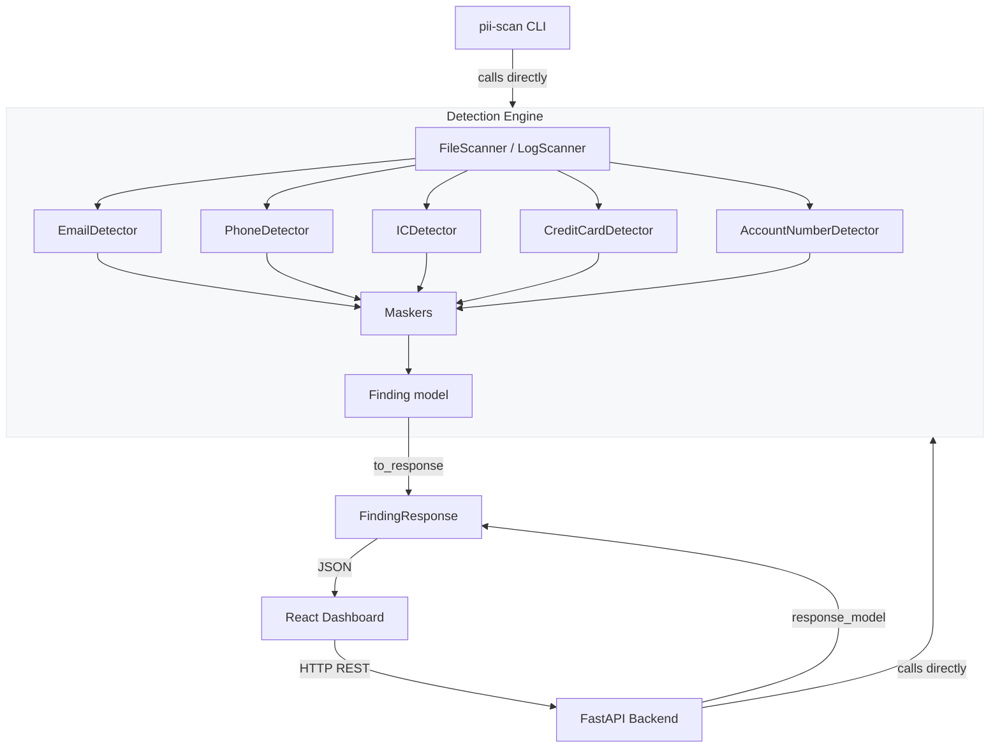

# PII Log Leak Detector

> **⚠️ Prototype Notice:** This is a portfolio/hackathon tool. Pattern-based detection **will produce false positives** and **may miss non-standard PII formats**. Do not use as a sole compliance mechanism.


---

## Problem

Personally identifiable information (PII) leaking into application logs is one of the most common — and most underestimated — data protection failures. A single `logger.info(f"Processing order for {user.email}")` line in a payment service can result in email addresses, phone numbers, national ID numbers, and credit card digits being written into plaintext log files, shipped to centralised logging platforms, and retained indefinitely. Developers rarely notice because the leak produces no error; it is invisible in code review, passes all functional tests, and only surfaces during a security audit or breach investigation. In heavily regulated markets this can constitute a PDPA, GDPR, or PCI-DSS violation.

---

## Solution

**PII Log Leak Detector** is a developer security tool that statically scans Python source files and log files for accidentally exposed PII. It provides a CLI for local pre-commit or CI use and a React dashboard for interactive exploration. All detected values are masked before display — the raw PII value never leaves the detection engine. The tool ships with a deliberately vulnerable demo application that demonstrates the full detect → recommend → fix → rescan workflow.

---

## Key Features

- **Five PII detectors** — email, phone (Malaysian & generic), Malaysian IC (NRIC), credit/debit card numbers, and account numbers.
- **Dual-surface interface** — identical detection engine shared by the CLI tool and the FastAPI/React web dashboard.
- **Always-masked output** — raw PII values are structurally absent from all API responses and CLI output. A two-model pattern (`Finding` vs `FindingResponse`) enforces this at the type level.
- **Context-aware severity** — findings near logging statements (`logger.info`, `print(`, `raise`) are escalated to HIGH severity.
- **Demo fix workflow** — `pii-scan fix` replaces vulnerable demo files with pre-written clean versions and automatically rescans, showing the before/after difference.
- **Log file scanning** — dedicated `scan-log` command treats every line as live log output, flagging PII that has already been emitted.
- **Docker-ready** — `docker compose up --build` starts the full stack with one command.
- **Zero external dependencies for detection** — the detection engine uses only the Python standard library (`re`). No cloud APIs, no ML models, no LLMs.

---

## Architecture



**Key insight:** The detection engine is a plain Python package with no FastAPI dependency. The CLI imports it directly; the web backend is a thin HTTP wrapper around the same functions.

---

## Tech Stack

| Layer | Technology |
|---|---|
| **Backend API** | FastAPI 0.111, Uvicorn, Pydantic v2 |
| **Detection Engine** | Pure Python 3.11, `re` module |
| **CLI** | Click, Rich |
| **Frontend** | React 18, TypeScript, Vite, Tailwind CSS |
| **Testing** | pytest, pytest-asyncio, httpx |
| **Linting** | ruff |
| **Infrastructure** | Docker, docker compose, nginx |
| **CI** | GitHub Actions |

---

## Screenshots

> See `/docs/screenshots/` after running the demo, or visit `http://localhost:3000` with the stack running.

The dashboard shows:
- Summary cards (total findings, HIGH / MEDIUM / LOW counts, files scanned)
- A findings table with masked PII values, file path, line number, severity badge, and recommended fix
- One-click "Fix Demo" and "Rescan" buttons

---

## CLI Examples

### Scan a directory for PII in source files

```
$ pii-scan scan ./demo_vulnerable_app

🔍 Scanning: ./demo_vulnerable_app
   Files scanned : 4
   Findings      : 11

Findings
────────────────────────────────────────────────────────────────────────────────
 #   File                      Line  Type            Severity  Masked Value
────────────────────────────────────────────────────────────────────────────────
 1   customer_service.py         14  Email           HIGH      j***@example.com
 2   customer_service.py         27  Phone           HIGH      +601*****89
 3   customer_service.py         41  Malaysian IC    HIGH      901231-**-****
 4   payments.py                  9  Credit Card     HIGH      4111 **** **** 1111
 5   payments.py                 22  Account Number  MEDIUM    ACC-******7890
 6   errors.py                    8  Email           HIGH      s***@corp.com
 ...

Summary: 9 HIGH  ·  2 MEDIUM  ·  0 LOW
```

### Scan a log file

```
$ pii-scan scan-log ./demo_logs/app.log

🔍 Scanning log: ./demo_logs/app.log
   Lines scanned : 120
   Findings      : 7

Findings
────────────────────────────────────────────────────────────────────────────────
 #   Line   Type            Severity  Masked Value          Detection Reason
────────────────────────────────────────────────────────────────────────────────
 1    18    Email           HIGH      a***@bank.com.my      Found in application log file
 2    34    Phone           HIGH      +601*****23           Found in application log file
 3    51    Credit Card     HIGH      5412 **** **** 3456   Found in application log file
 ...

Summary: 6 HIGH  ·  1 MEDIUM  ·  0 LOW
```

### Apply the demo fix and rescan

```
$ pii-scan fix ./demo_vulnerable_app

🔧 Applying demo fix...
   Replaced: customer_service.py
   Replaced: payments.py
   Replaced: errors.py
   Replaced: utils.py

🔍 Rescanning after fix...
   Files scanned : 4
   Findings      : 0

✅ Clean — no PII found after fix.
```

---

## Web Application Usage

1. Start the stack: `docker compose up --build` (or `uvicorn backend.app.main:app --reload` locally).
2. Open `http://localhost:3000` in your browser.
3. Click **"Scan Demo App"** — the backend scans `demo_vulnerable_app/` and returns masked findings.
4. Review the findings table. Each row shows the PII type, masked value, file, line number, severity, and a recommended fix.
5. Click **"Fix Demo"** to apply the pre-written clean replacements. The backend rescans automatically.
6. The summary cards update to show zero findings, demonstrating the full clean-up workflow.
7. Click **"Rescan"** at any time to re-run the scan from scratch.

---

## Running Locally

**Prerequisites:** Python 3.11+, Node.js 18+

```bash
# Clone the repository
git clone https://github.com/your-username/pii-log-leak-detector.git
cd pii-log-leak-detector

# Create and activate a virtual environment
python -m venv .venv
source .venv/bin/activate          # Windows: .venv\Scripts\activate

# Install Python dependencies
pip install -r requirements.txt

# Install the CLI in editable mode
pip install -e .

# Start the backend
uvicorn backend.app.main:app --reload
# Backend available at http://localhost:8000
# API docs at       http://localhost:8000/docs

# In a separate terminal — start the frontend
cd frontend
npm install
npm run dev
# Frontend available at http://localhost:5173
```

### Verify the backend is up

```bash
curl http://localhost:8000/health
# {"status":"ok"}
```

### Run the CLI against the demo app

```bash
pii-scan scan ./demo_vulnerable_app
pii-scan scan-log ./demo_logs/app.log
pii-scan fix ./demo_vulnerable_app
```

---

## Running with Docker

```bash
docker compose up --build
```

| Service | URL |
|---|---|
| Frontend | http://localhost:3000 |
| Backend API | http://localhost:8000 |
| API Docs (Swagger) | http://localhost:8000/docs |
| Health check | http://localhost:8000/health |

To stop: `docker compose down`

---

## Running Tests

```bash
# Activate the virtual environment first
source .venv/bin/activate

# Run all tests with verbose output
pytest backend/tests/ -v
```

Expected output format:

```
backend/tests/test_detectors.py::test_email_detector_finds_email PASSED
backend/tests/test_detectors.py::test_phone_detector_finds_malaysian PASSED
backend/tests/test_detectors.py::test_ic_detector_finds_hyphenated PASSED
backend/tests/test_detectors.py::test_credit_card_detector_finds_visa PASSED
backend/tests/test_maskers.py::test_mask_email PASSED
backend/tests/test_maskers.py::test_mask_phone PASSED
backend/tests/test_maskers.py::test_mask_ic PASSED
backend/tests/test_file_scanner.py::test_scan_file_finds_pii PASSED
backend/tests/test_log_scanner.py::test_scan_log_file PASSED
backend/tests/test_api.py::test_scan_demo_returns_findings PASSED
backend/tests/test_api.py::test_matched_value_absent_from_response PASSED
backend/tests/test_security.py::test_validate_zip_rejects_path_traversal PASSED
...

========================= XX passed in X.XXs =========================
```

---

## Example Detection Results

The demo vulnerable app contains these deliberate PII leaks:

```
customer_service.py:14  →  Email        j***@example.com       [HIGH]   near logger.info
customer_service.py:27  →  Phone        +601*****89            [HIGH]   near logger.info
customer_service.py:41  →  Malaysian IC 901231-**-****         [HIGH]   near logger.debug
payments.py:9           →  Credit Card  4111 **** **** 1111    [HIGH]   near print(
payments.py:22          →  Account No.  ACC-******7890         [MEDIUM] contextual match
errors.py:8             →  Email        s***@corp.com.my       [HIGH]   near raise
utils.py:15             →  Phone        +601*****34            [HIGH]   near logger.warning
```

After running `pii-scan fix ./demo_vulnerable_app` (or clicking "Fix Demo"), the next scan returns:

```
Files scanned: 4   Findings: 0

✅ No PII found.
```

---

## Security Considerations

- **Raw PII never in API responses.** The `Finding` (internal) and `FindingResponse` (API) are separate Pydantic models. `matched_value` does not exist on `FindingResponse` — it cannot be accidentally serialised. FastAPI's `response_model=ScanResultResponse` adds a second serialisation pass as a defence-in-depth measure.
- **Fix is limited to the demo app.** `fix_service.py` only copies pre-written `_fixed/` files into `demo_vulnerable_app/`. It does not execute user-supplied code, apply dynamic patches, or write outside the demo directory.
- **No uploaded code is executed.** ZIP uploads are read as text; each file is passed as a string to regex detectors. There is no `eval`, `exec`, or subprocess invocation.
- **ZIP path traversal prevention.** `security.py` rejects ZIP entries with absolute paths or `..` components before extraction. Resolved paths are verified to remain within the destination directory.
- **Size limits on uploads.** A configurable `MAX_UPLOAD_BYTES` cap prevents DoS via large archive uploads.
- **Stateless — no persistence.** Scan results are held in an in-memory dict on the FastAPI `app.state` object. They are cleared on restart. There is no database, no file cache, and no user data stored to disk.
- **No authentication required by design.** This is a local developer tool, not a multi-tenant SaaS. Authentication would be appropriate before any public deployment.
- **CORS is configured explicitly.** `CORSMiddleware` allows only the configured frontend origin, not wildcard `*`, in the default configuration.

---

## Limitations

- **False positives are expected.** Regular expressions cannot understand context. A string like `account: 123456` in a comment will be flagged even if it is a legitimate reference number.
- **False negatives are possible.** PII in non-standard formats (e.g. written-out phone numbers, obfuscated strings, Base64-encoded values) will not be detected.
- **Malaysian-focused phone and IC detection.** The phone detector has a high-confidence path for Malaysian `+60` / `01X` numbers. Generic international numbers use a lower-confidence fallback pattern.
- **Source code files only.** The scanner reads `.py`, `.js`, `.ts`, `.txt`, `.log`, `.env`, `.json`, `.yaml`, `.yml`, `.toml` files. Binary files and unsupported extensions are skipped.
- **Demo fix is not a real remediation tool.** The fix workflow copies pre-written clean files. It does not parse, transform, or rewrite arbitrary source code.
- **In-memory state.** The API server does not persist scan results. Restarting the backend clears all cached scans.
- **Prototype status.** This project was built as a hackathon/portfolio demonstration. It is not a certified PDPA, GDPR, or PCI-DSS compliance tool.

---

## Future Improvements

- **AST-based detection** — parse Python source into an AST to distinguish actual logging calls from commented-out code and string literals, dramatically reducing false positives.
- **Additional PII types** — passport numbers, IBAN/BIC codes, AWS access key patterns, JWT tokens, private key headers.
- **Configurable allowlist / denylist** — let teams annotate lines with `# pii-scan: ignore` or provide a config file of safe patterns to suppress.
- **CI/CD integration report** — produce a machine-readable JSON report and a non-zero exit code on HIGH findings, suitable for blocking pipelines.
- **Historical trending** — store scan results in SQLite or a time-series backend to track whether PII leaks are increasing or decreasing across commits.
- **VS Code extension** — surface findings as inline diagnostics in the editor, with one-click recommended fixes, without leaving the IDE.
